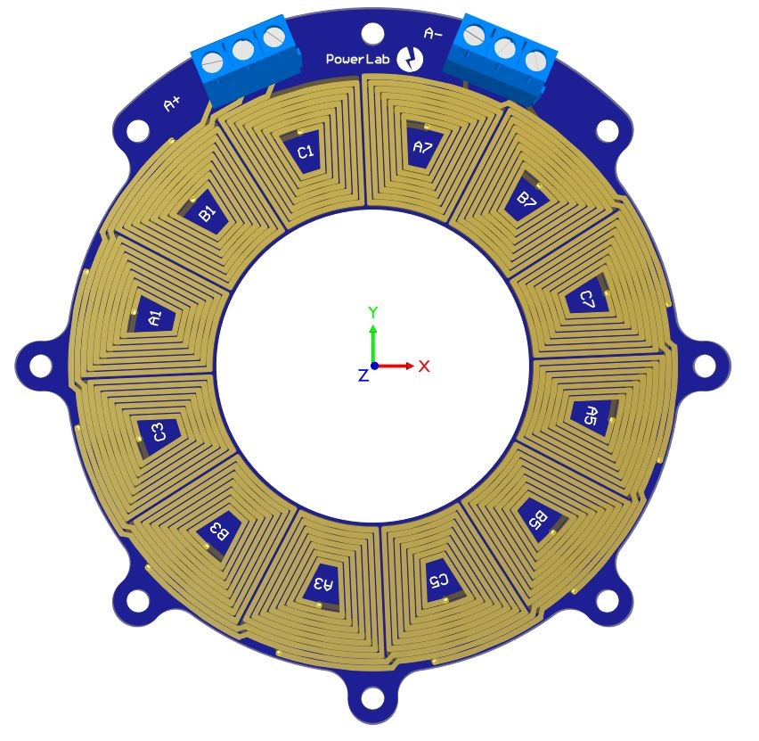
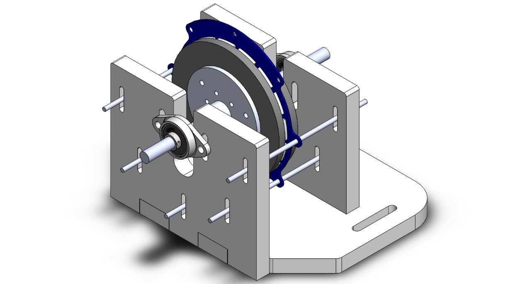
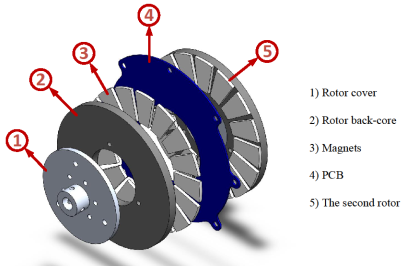

 ## The Design and Implementation of PCB Motor
 ### Brief Summary: 
 Axial-flux machines are becoming more and more popular due to their small length and high dynamic performance, namely high torque and power density. But the main problem with the axial-flux machines is that they are not easy to mass produce due to their slotless stators. PCB motor is a type of the axial-flux motors whose windings are positioned on a printed circuit board. The windings are easy to mass produce and they can work on high speeds. Because of thin copper traces eddy current losses on the windings will be negligibly small. PCB winding technology is a promising area in the future, due to their suitability for mass production with high accuracy and easy integration with power electronics units.

#### Properties & Advantages

•	Shorter axial length
•	Easy to manufacture
•	Low torque ripple
•	High torque density
•	Low inductance & better dynamics

In this research, we have analytically calculated the motor parameters starting from Maxwell’s equations. After that, using a genetic algorithm the design parameters are optimized. Finite element analysis of the motor is conducted on ANSYS Maxwell. Finally, the prototype is tested under different load conditions and results of the analytical calculations and finite element analysis is validated. 

